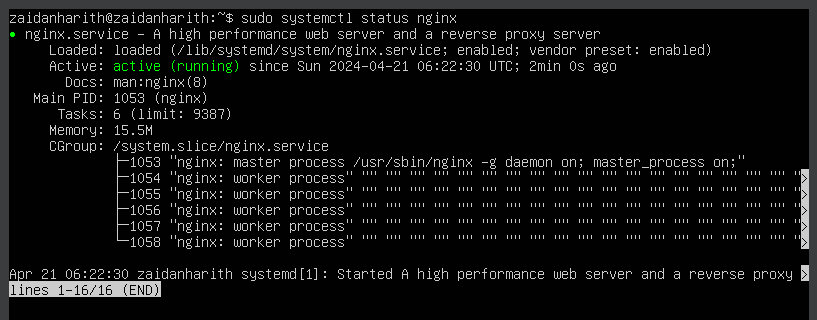
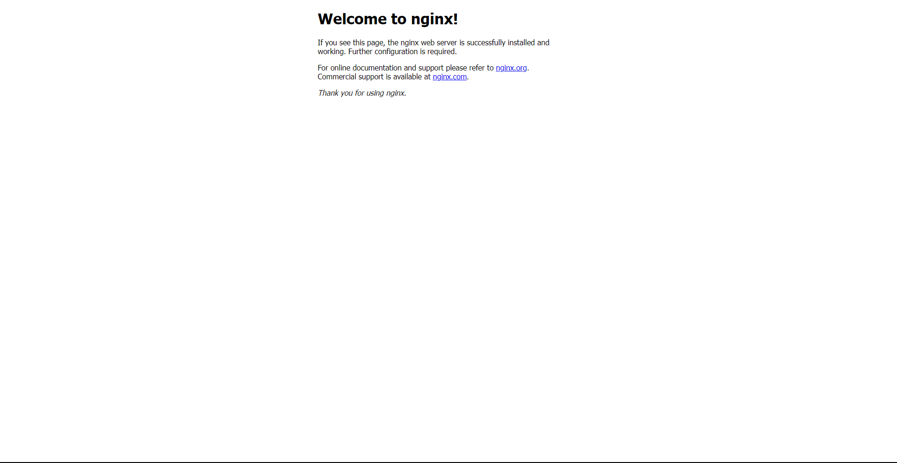

# Cara Install Domjudge dengan Docker, NGINX, dan Ubuntu Server

Created by : [Zaidan Harith](https://github.com/zaidanharith)

Instagram : [@zaidanharith\_](https://instagram.com/zaidanharith_)

Berikut langkah-langkah untuk meng-_install_ Domjudge dengan menggunakan Docker, NGINX, dan Ubuntu Server.

Selamat mencoba semuanya !

## 1. Instalasi Ubuntu Server dengan Virtual Machine (VirtualBox)

Bagi kalian yang sistem operasinya selain Linux (Ubuntu), kalian bisa men-_download_ dan meng-_install_ Virtual Machine terlebih dahulu agar bisa menjalankan Ubuntu Server di sistem operasi kalian. Untuk Virtual Machine yang akan digunakan adalah Oracle VirtualBox.

Untuk instalasi Ubuntu Server dan Oracle VirtualBox, kalian bisa mengikuti tutorial Youtube berikut :

[Install Ubuntu Server 22.04 LTS in Virtual Box; Connect with SSH](https://youtu.be/ElNalqvVaPw?feature=shared)

Video oleh : [babarehner](https://www.youtube.com/@babarehner)

## 2. Instalasi NGINX di Ubuntu Server

Setelah Ubuntu Server di-_install_ di dalam Virtual Machine (VirtualBox), kita perlu meng-_install_ NGINX di dalam Ubuntu Server agar dapat menjalankan Web Server. Langkah-langkah instalasi adalah sebagai berikut :

1. Pada Ubuntu Server, ketikkan perintah berikut agar Ubuntu Server lebih _update_.
   ```
   sudo apt update
   ```
2. NGINX dapat di-_install_ dengan mengetik :

   ```
   sudo apt -y install nginx
   ```

3. NGINX sudah terpasang di Ubuntu Server. Untuk mengecek apakah NGINX sudah berjalan atau belum, ketikkan perintah berikut.

   ```
   sudo systemctl status nginx
   ```

4. Apabila NGINX berhasil dijalankan, tampilan Ubuntu Server akan seperti berikut

   

5. Untuk menjalankan NGINX pada Web Browser, ketikkan alamat IP pada URl. Alamat IP Server dapat diketahui dengan mengetik

   ```
   ip a
   ```

6. Tampilan Web Browser apabila NGINX berhasil berjalan seperti berikut :



## 3. Menghubungkan Ubuntu Server ke Terminal OS dengan SSH

Sebelum kita lanjut ke langkah selanjutnya, untuk mempermudah kalian dalam mengikuti beberapa langkah selanjutnya, kita akan menghubungkan Ubuntu Server ini dengan terminal yang ada di sistem operasi kita dengan menggunakan SSH. Kemudahan yang dimaksud di sini adalah _Copy-Paste_ ataupun _Drag and Drop_ kode dari luar terminal.

Langkah pertama yang perlu dilakukan adalah dengan meng-_install_ OpenSSH Client dan Server di dalam Ubuntu Server dengan dua _command_ berikut :

```
sudo apt install openssh-client
```

dan juga

```
sudo apt install openssh-server
```

Kemudian, pada terminal di sistem operasi kalian, ketikkan _command_ berikut :

```
ssh [Username Ubuntu Server]@[Alamat IP]
```

Contoh : `ssh zaidanharith@192.168.123.456>`.

Ketik _Enter_ dan kalian akan diminta memasukkan _password_ Ubuntu Server untuk _username_ tersebut. Setelah memasukkan _password_, terminal kalian sudah berhasil terhubung ke Ubuntu Server. Sekarang, kalian sudah bisa menjalankan semua _command_ yang ada di Ubuntu Server di dalam terminal kalian. Oleh karena itu, untuk mengikuti beberapa langkah ke depannya, kalian disarankan untuk mengggunakan Ubuntu Server di terminal sistem operasi kalian.

## 4. Instalasi Docker di Ubuntu Server

Langkah instalasi Docker di dalam Ubuntu Server :

Sumber : [Installing Ubuntu Server With Docker](https://youtu.be/Sku9pRzuIi8?feature=shared)

Video oleh : [Steve's Tech Stuff](https://www.youtube.com/@StevesTechStuff)

1. _Update_ Server terlebih dahulu.

   ```
   sudo apt-get update
   ```

2. _Install library_ pendukung.

   ```
   sudo apt install apt-transport-https ca-certificates curl software-properties-common
   ```

3. Tambahkan kunci GPG untuk Repository Docker.

   ```
   curl -fsSL https://download.docker.com/linux/ubuntu/gpg | sudo apt-key add -
   ```

4. Tambahkan Repository Docker.

   ```
   sudo add-apt-repository "deb [arch=amd64] https://download.docker.com/linux/ubuntu bionic stable"
   ```

5. _Update_ kembali Ubuntu Server-nya.

   ```
   sudo apt-get update
   ```

6. Cek Repository Docker.

   ```
   apt-cache policy docker-ce
   ```

7. Lakukan instalasi Docker.

   ```
   sudo apt install docker-ce
   ```

8. Lakukan _reboot_ pada Ubuntu Server agar Docker dapat berjalan.

   ```
   sudo reboot
   ```

9. Docker telah di-_install_ di Ubuntu Server. Untuk mengecek apakah Docker sudah berjalan, gunakan _command_

```
sudo systemctl status docker
```

## 5. Instalasi Domserver di Ubuntu Server dengan Docker dan NGINX

Untuk meng-_install_ Domserver menggunakan Docker dan NGINX, ikuti langkah berikut :

1. Buka _file_ `nginx.conf` pada direktori `/etc/nginx` dengan menggunakan _command_

   ```
   cd /etc/nginx/
   ```

   dan dilanjutkan dengan _command_

   ```
   sudo nano nginx.conf
   ```

   untuk membuka dan mengubah file `nginx.conf`. _Scroll_ ke bawah dan pastikan ada baris yang tertulis `include /etc/nginx/conf.d/*.conf`. Jika tidak ada, tambahkan baris tersebut pada file `nginx.conf` tersebut.

2. Pada direktori yang sama, yaitu `/etc/nginx`, masuk ke folder `conf.d` dengan menggunakan _command_

   ```
   cd conf.d
   ```

   sehingga, direktori saat ini jika ditelusuri dari _root_ adalah `/etc/nginx/conf.d`.

3. Pada folder `conf.d` tersebut, buat _file_ dengan nama `domjudge.conf` dengan menggunakan _command_

   ```
   sudo nano domjudge.conf
   ```

4. Di dalam _file_ `domjudge.conf`, isikan dengan kode berikut :

   (_Copy-Paste_ atau _Drag and Drop_ kodenya saja)

   ```

        server {
             listen 80;
             listen [::]:80;

             server_name [Alamat IP] [Nama Domain];

             location / {
             proxy_set_header Host $host;
             proxy_set_header X-Real-IP $remote_addr;
             proxy_set_header X-Forwarded-For $proxy_add_x_forwarded_for;

             proxy_pass http://localhost:12345/;
             }
        }

   ```

   Contoh :

   ```

   server {
   listen 80;
   listen [::]:80;

        server_name 192.168.123.456 mywebsite.id;

        location / {
        proxy_set_header Host $host;
        proxy_set_header X-Real-IP $remote_addr;
        proxy_set_header X-Forwarded-For $proxy_add_x_forwarded_for;

        proxy_pass http://localhost:12345/;
        }

   }

   ```

5. Kemudian, simpan _file_ tersebut dengan _shorthand_ `ctrl+s` dan keluar dari _file_ tersebut dengan shorthand `ctrl+x`.

6. _Reload_ NGINX dengan menggunakan _command_

   ```
   sudo nginx -s reload
   ```

   dan kembali ke folder _root_ dengan _command_

   ```
   cd
   ```

7. Masuk ke folder dengan direktori `/etc/default/` dengan _command_

   ```
   cd /etc/default/
   ```

   dan buka _file_ `grub` yang di folder tersebut dengan menggunakan _command_

   ```
   sudo nano grub
   ```

8. Di dalam _file_ tersebut, terdapat baris yang bertuliskan `GRUB_CMDLINE_LINUX_DEFAULT=""`. Tambahkan kode berikut di antara dua tanda petik (`""`) :

   ```
   cgroup_enable=memory swapaccount=1 systemd.unified_cgroup_hierarchy=0
   ```

   sehingga, satu baris tersebut akan menjadi `GRUB_CMDLINE_LINUX_DEFAULT="cgroup_enable=memory swapaccount=1 systemd.unified_cgroup_hierarchy=0"`.

9. Simpan dan keluar dari _file_ tersebut dengan _shorthand_ `ctrl+s` dan `ctrl+x`.

10. _Reboot_ Ubuntu Server dengan menggunakan _command_

    ```
    sudo reboot
    ```

11. Setelah di-_reboot_, Ubuntu Server akan dimulai ulang, sehingga jika kalian menggunakan terminal di sistem operasi, maka sambungan SSH dengan Ubuntu Server akan terputus. Jika proses _reboot_ sudah selesai, kalian bisa kembali menyambungkan Ubuntu Server ke terminal kalian dengan menggunakan _command_

    ```
    ssh [Username Ubuntu Server]@[Alamat IP]
    ```

    di terminal kalian (persis sama dengan yang sudah kita lakukan sebelumnya saat meng-_install_ SSH).

12. Buat _file_ dengan nama `docker-compose.yml` dengan _command_

    ```sudo nano docker-compose.yml

    ```

    _File_ tersebut boleh berada di folder _root_ ataupun yang lain. Namun, disarankan untuk membuat folder baru saja karena apabila kalian ingin membuat program lain dengan Docker, tidak perlu mengganti _file_ `docker-compose.yml` tersebut. Untuk membuat folder baru, kalian bisa menggunakan _command_

    ```
    mkdir [Nama File]
    ```

    dan untuk masuk ke folder tersebut bisa menggunakan _command_

    ```
    cd [Nama File]
    ```

13. Isikan _file_ `docker-compose.yml` dengan kode berikut :

    (_Copy-Paste_ atau _Drag and Drop_ kodenya saja)

    ```
    version: '3.9'

    networks:
         domjudge:
              name: domjudge

    services:
         mariadb:
              container_name: mariadb
              image: mariadb:latest
              networks:
                   - domjudge
              ports:
                   - 13306:3306
              environment:
                   - MYSQL_ROOT_PASSWORD=rootpw
                   - MYSQL_USER=domjudge
                   - MYSQL_PASSWORD=djpw
                   - MYSQL_DATABASE=domjudge
              command: --max-connections=1000

    domserver:
         container_name: domserver
         image: domjudge/domserver:latest
         volumes:
              - /sys/fs/cgroup:/sys/fs/cgroup:ro
         networks:
              - domjudge
         ports:
              - 12345:80
         depends_on:
              - mariadb
         environment:
              - CONTAINER_TIMEZONE=Asia/Jakarta
              - MYSQL_HOST=mariadb
              - MYSQL_ROOT_PASSWORD=rootpw
              - MYSQL_USER=domjudge
              - MYSQL_PASSWORD=djpw
              - MYSQL_DATABASE=domjudge

    judgehost-0:
         container_name: judgehost-0
         image: domjudge/judgehost:latest
         privileged: true
         hostname: judgedaemon-0
         volumes:
              - /sys/fs/cgroup:/sys/fs/cgroup:ro
         networks:
              - domjudge
         depends_on:
              - domserver
         environment:
              - DAEMON_ID=0
              - JUDGEDAEMON_PASSWORD=mVg2GIgM0tsujQwYuJlqu4NZ2K76hr7r

    judgehost-1:
         container_name: judgehost-1
         image: domjudge/judgehost:latest
         privileged: true
         hostname: judgedaemon-1
         volumes:
              - /sys/fs/cgroup:/sys/fs/cgroup:ro
         networks:
              - domjudge
         depends_on:
              - domserver
         environment:
              - DAEMON_ID=1
              - JUDGEDAEMON_PASSWORD=mVg2GIgM0tsujQwYuJlqu4NZ2K76hr7r

    judgehost-2:
         container_name: judgehost-2
         image: domjudge/judgehost:latest
         privileged: true
         hostname: judgedaemon-2
         volumes:
              - /sys/fs/cgroup:/sys/fs/cgroup:ro
         networks:
              - domjudge
         depends_on:
              - domserver
         environment:
              - DAEMON_ID=2
              - JUDGEDAEMON_PASSWORD=mVg2GIgM0tsujQwYuJlqu4NZ2K76hr7r

    judgehost-3:
         container_name: judgehost-3
         image: domjudge/judgehost:latest
         privileged: true
         hostname: judgedaemon-3
         volumes:
              - /sys/fs/cgroup:/sys/fs/cgroup:ro
         networks:
              - domjudge
         depends_on:
              - domserver
         environment:
              - DAEMON_ID=3
              - JUDGEDAEMON_PASSWORD=mVg2GIgM0tsujQwYuJlqu4NZ2K76hr7r
    ```

14. Di folder yang sama dengan _file_ `docker-compose.yml` tersebut, aktifkan MariaDB dan Domserver dengan menggunakan command

    ```
    docker-compose up -d mariadb domserver
    ```

15. Pada _file_ `docker-compose.yml`, di setiap bagian `judgehost` (di _file_ tersebut, jumlahnya ada 4), ada bagian yang bertuliskan `JUDGEDAEMON_PASSWORD=mVg2GIgM0tsujQwYuJlqu4NZ2K76hr7r`. Ganti `mVg2GIgM0tsujQwYuJlqu4NZ2K76hr7r` dengan Password Judgedaemon kalian. Password dapat dilihat dengan menggunakan _command_

    ```
    docker exec -it domserver cat /opt/domjudge/domserver/etc/restapi.secret
    ```

    Sebagai contoh, `JUDGEDAEMON_PASSWORD=ai3nuJlqu4NZX7pU8HNTyvG`.

    > ! Ingat lagi bagaimana cara membuka _file_ di Ubuntu Server

16. Setelah Password Judgedaemon diganti, jalankan Judgehost dengan menggunakan _command_

    ```
    docker-compose up -d
    ```

17. Untuk menjalankan Domjudge, kalian bisa masuk menggunakan alamat IP kalian di dalam Web Browser kalian.

18. Selamat! Kalian sudah berhasil membuat Domjudge dengan menggunakan Docker, NGINX dan Ubuntu Server.
